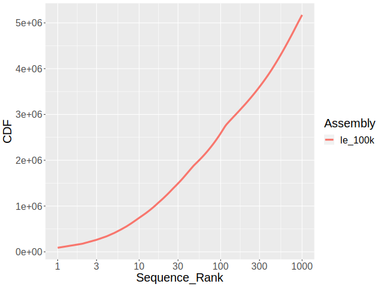
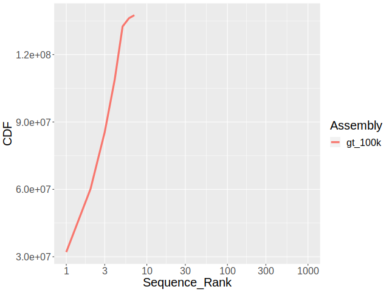
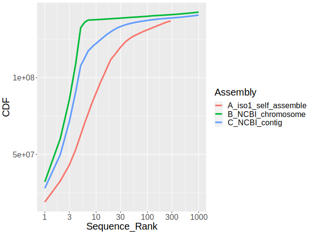
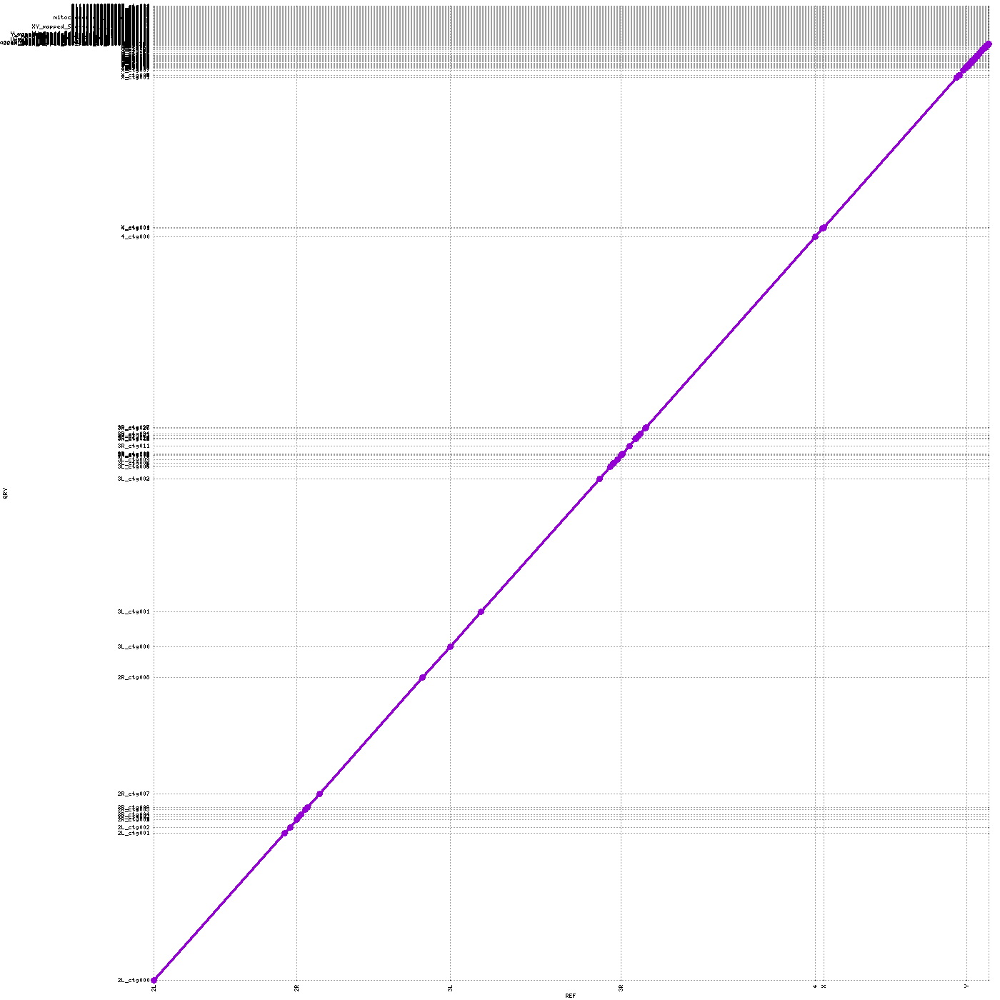

# Homework 4

## Calculate the following for all sequences ≤ 100kb and all sequences > 100kb

First, we switched our directory and worked on the existing reference chromosome file. With `faFilter`, we could separate the sequences according to their length and save them in different fasta files. Viewing the output help make sure the correctness. 

```bash
conda activate ee282
cd /pub/jenyuw/classrepos/EE282
# saving the sequences
faFilter -maxSize=100000 dmel-all-chromosome-r6.48.fasta le_100k.fasta
faFilter -minSize=100001 dmel-all-chromosome-r6.48.fasta gt_100k.fasta
# checking the results
bioawk -c fastx '{print $seq}' le_100k.fasta |awk '{print length}'|sort -r -n|head -100|less
```
To answer the first qustion, `faSize` telled us the detailes.

```bash
faSize le_100k.fasta
faSize gt_100k.fasta
# a rapid way
faFilter -minSize=100001 <(zcat dmel.chr.gz) /dev/stdout | faSize /dev/stdin
```
The following is one of the out put form `faSize`.

```bash
6178042 bases (662593 N's 5515449 real 5515449 upper 0 lower) in 1863 sequences in 1 files
Total size: mean 3316.2 sd 7116.2 min 544 (211000022279089) max 88768 (Unmapped_Scaffold_8_D1580_D1567) median 1567
N count: mean 355.7 sd 1700.6
U count: mean 2960.5 sd 6351.5
L count: mean 0.0 sd 0.0
%0.00 masked total, %0.00 masked real
```


### **Answer:**

||≤ 100kb|> 100kb|
|---|---|---|
|Total number of nucleotides|6178042|137547960|
|Total number of Ns|662593|490385|
|Total number of sequences|1863|7|


## Plots of the following for for all sequences ≤ 100kb and all sequences > 100kb

First, we generated files containing the name and the length of each sequence. `faSeize` did not generate headers.

```bash
faSize -detailed le_100k.fasta >le_100k_length.txt
faSize -detailed gt_100k.fasta >gt_100k_length.txt
#another way
bioawk -c fastx ' {print $name "\t" length($seq) "\t" gc($seq)}' le_100k.fasta >le_100k_length.txt
```
Second, with `bioawk`, we could extract both the GC-contents and the lengths of sequence. Here, we used `bioawk` to generate files without the headers. The files contained the name and the GC-content of each sequence.

```bash
bioawk -c fastx ' {print $name "\t" gc($seq)}' le_100k.fasta >le_100k_gc.txt
bioawk -c fastx ' {print $name "\t" gc($seq)}' gt_100k.fasta >gt_100k_gc.txt
```
To make histograms, we used R program. A *`for`* loop was used to save space. Some options, such as "binwidth" and "scale_x_log10()" were incoporated to improve the presentation.

```r
library(ggplot2)
library(data.table)
library(scales)
# for length distribution
lenfiles <- dir('/Users/Oscar/Desktop/plotting', pattern = '*length.txt', full.names = FALSE)
for (f in lenfiles) {
  tab <- read.table(f, header=FALSE)
  len <- ggplot(data=tab)

  png(filename = paste(substring(f,0,14), ".png"),width = 800, height = 600, units = "px",)

  print(
    len + geom_histogram(mapping=aes(x=tab[,2]) , binwidth = 0.04) + scale_x_log10()+
    labs(title= paste(f), x = "log10 length (bp)", y = "count" )
  )

  dev.off()
}

# for GC content distribution
gcfiles <- dir('/Users/Oscar/Desktop/plotting', pattern = '*gc.txt', full.names = FALSE)

for (f in gcfiles) {
  tab <- read.table(f)
  gc <- ggplot(data= tab)
  png(filename = paste(substring(f,0,10), ".png"),width = 800, height = 600, units = "px")
  print(
    gc + geom_histogram(mapping=aes(x=tab[,2]), binwidth = 0.005) +
    labs(title= paste(f), x = "GC content (%)", y = "count" )
  )
  dev.off()
}
```

The third part was making cumulative plot of sequence sizes. Because `plotCDF` only presented the front 300 counts, we used `plotCDF2`here.


```bash
cd /pub/jenyuw/classrepos/EE282

sort -k 2,2 -n -r  le_100k_length.txt |gawk 'BEGIN {print "Name \t Length \t Assembly"} {print $1 "\t" $2 "\t" "le_100k"}' |plotCDF2 /dev/stdin le.100k.cdf.png

sort -k 2,2 -n -r  gt_100k_length.txt |gawk 'BEGIN {print "Name \t Length \t Assembly"} {print $1 "\t" $2 "\t" "gt_100k"}' |plotCDF2 /dev/stdin gt.100k.cdf.png
```

### **Answer:**

||≤ 100kb|> 100kb|
|---|---|---|
|Length distribution|||
|GC content distribution|||
|CDF plot|||


-------------------------------------------

## Assemble a genome from MinION reads

We used `minimap2` to overlap reads and construct the contigs with `miniasm`. For further analysis, **gfa** file was transformed into **fasta** format.

```bash
conda activate ee282
cd /pub/jenyuw/classrepos/EE282
minimap2 -t 60 -x ava-ont iso1_onp_a2_1kb.fastq iso1_onp_a2_1kb.fastq > overlaps.paf
miniasm -f iso1_onp_a2_1kb.fastq overlaps.paf > iso1_self_assemble.gfa
#transformation
awk '/^S/{print ">"$2"\n"$3}' iso1_self_assemble.gfa | fold > iso1_self_assemble.fa
```
The primary output of `miniasm` , gfa format, looked like:

```bash
S       utg000001l      TCGGCTCCTGATGGATCCAACTGCTGCTGTAATGGGGAGCCACACCGGCGCTCCAACCTAAGAAAGATAATGTCTTAGTTTTTCT
TTTCCTTTCTCGCAAAAACAACAGCGCATCTGGCGTCTGATAATAGCTTTAGCTCACAAGACAGCAAAAACAACAGCATCAAGGCCAGCAACAGTGGGCAGAGACCGAA
GCGGTGTCGCCCAACATTTGCTGCCCGCATCCACCATTCCTGGAGGATCTGAATGAGGAGTTGAAGCCTCTGAGGAATTTGAAGATCCGACTC
......
......
```


## Assembly assessment

First, length of each sequence was generated by `faSize` and extracted with `gawk`. Cumulative length and N50 were then calculated. The N50 of scafolds and contigs were available on NCBI webpage directly.

```bash
faSize -detailed iso1_self_assemble.fa | gawk ' {n=n+$2; print $2} END { print n; }'|sort -rn|\
gawk ' NR==1 { n = $1 }; NR > 1 { ni = $1 + ni; } ni/n > 0.5 { print $1; exit; } '
#output
7910018
```

Second, the chromosome assembly was disrupted with `faSplitByN`. Then, we reused the scripts to generate the files required for `plotCDF2`. One contiguity plot was made from three files together. 

```bash
#installing the dependency
conda install -c conda-forge perl
conda install -c bioconda perl-bioperl
#making contigs
#the legands are given by aplhabetic orders istead of its original assignemnt
faSplitByN dmel-all-chromosome-r6.48.fasta dmel-all-contig.fa 20

faSize -detailed iso1_self_assemble.fa|sort -k 2,2 -n -r |gawk 'BEGIN {print "Name \t Length \t Assembly"} {print $1 "\t" $2 "\t" "A_iso1_self_assemble"}' >iso1_self_assemble_length.txt

faSize -detailed dmel-all-chromosome-r6.48.fasta|sort -k 2,2 -n -r |gawk 'BEGIN {print "Name \t Length \t Assembly"} {print $1 "\t" $2 "\t" "B_NCBI_chromosome"}' >r648_chr_length.txt

faSize -detailed dmel-all-contig.fa|sort -k 2,2 -n -r |gawk 'BEGIN {print "Name \t Length \t Assembly"} {print $1 "\t" $2 "\t" "C_NCBI_contig"}' >r648_contig_length.txt

plotCDF2 iso1_self_assemble_length.txt r648_chr_length.txt r648_contig_length.txt assembles.png
#plotCDF3 iso1_self_assemble_length.txt r648_chr_length.txt r648_contig_length.txt assembles3.png
```

Third, to access the BUSCO scores, we used the reference genome as the object in the biginning and let the program determine the lineage automatically. Then, the specific database, diptera_odb10, were used on our assembly.


```bash
conda install -c bioconda busco=5.4.3
busco --list-datasets
busco -i dmel-all-chromosome-r6.48.fasta -o r648_BUSCO -m genome --cpu 20 --auto-lineage-euk -f
#using specific database according to the original suggestions and results from automatic search. 
busco -i iso1_self_assemble.fa -o iso1_BUSCO2 -m genome --cpu 20 -l diptera_odb10
```


### **Answer:**

1. 

Our assembly had the shortest N50, which was 7910018.

The N50 of the scaffold (chromosome) on NCBI was 25286936.

The N50 of the contig on NCBI was   21485538.

2.

We can see the reference genome reached the platue quickly.




*Figure: The CDF plots of three assemblies. The green line refers to the scafold from NCBI. The blue line refers to the contigs broken from the NCBI scafolds. The red line refers to our assembly.*

3.
Our results showed the reference genome had much better BUSCO score, which reflects better assembly.

The BUSCO report of our assembly is:

```
        C:11.9%[S:11.9%,D:0.0%],F:5.5%,M:82.6%,n:3285
        390     Complete BUSCOs (C)
        390     Complete and single-copy BUSCOs (S)
        0       Complete and duplicated BUSCOs (D)
        181     Fragmented BUSCOs (F)
        2714    Missing BUSCOs (M)
        3285    Total BUSCO groups searched

Assembly Statistics:
        286     Number of scaffolds
        286     Number of contigs
        136800912       Total length
        0.000%  Percent gaps
        7 MB    Scaffold N50
        7 MB    Contigs N50

```

The BUSCO report of the reference genome is:

```
        C:98.7%[S:98.5%,D:0.2%],F:0.5%,M:0.8%,n:3285
        3243    Complete BUSCOs (C)
        3235    Complete and single-copy BUSCOs (S)
        8       Complete and duplicated BUSCOs (D)
        16      Fragmented BUSCOs (F)
        26      Missing BUSCOs (M)
        3285    Total BUSCO groups searched

Assembly Statistics:
        1870    Number of scaffolds
        2442    Number of contigs
        143726002       Total length
        0.802%  Percent gaps
        25 MB   Scaffold N50
        21 MB   Contigs N50
```

## Extra Credit

To generate a clear dorplot, the coordinates and uniqueness were assigned. The minimum alignment uniqueness was set to be 10. Only major chromosome arms were shown.

```bash
nucmer --mumreference --prefix=r648-chr_contig dmel-all-chromosome-r6.48.fasta dmel-all-contig.fa

#delta-filter -g r648-chr_contig.delta > r648-chr_contig-filtered.delta
#delta-filter -r -u 50 r648-chr_contig.delta > r648-chr_contig-filtered.delta
delta-filter -r -u 10 r648-chr_contig.delta > r648-chr_contig-filtered.delta

#mummerplot --png --large --prefix=r648-chr_contig r648-chr_contig-filtered.delta
mummerplot --png --large --prefix=r648-chr_contig_2 -R r648.Rfile r648-chr_contig-filtered.delta
```

### **Answer:**

1. 

The alignment dotplot is shown below. 




```bash
#redundant codes
mummer -mum -b -c dmel-all-chromosome-r6.48.fasta dmel-all-contig.fa > r648-chr_contig.mums
mummerplot --postscript --prefix=r648-chr_contig r648-chr_contig.mums
mummerplot -c --png -R dmel-all-chromosome-r6.48.fasta --prefix=r648-chr_contig r648-chr_contig.mums
mummerplot -c --png --prefix=r648-chr_self r648-chr_self.mums
```
